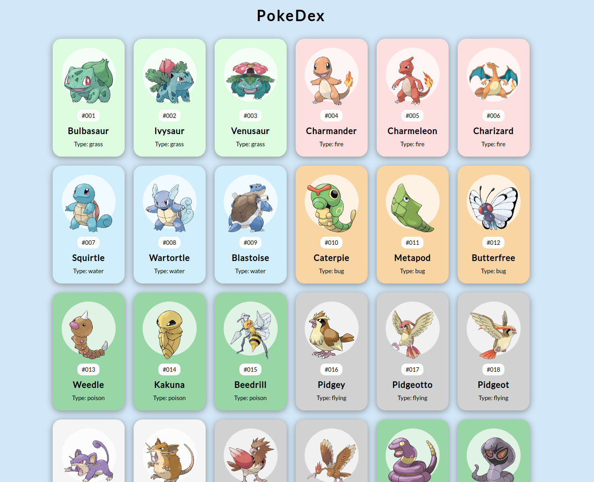
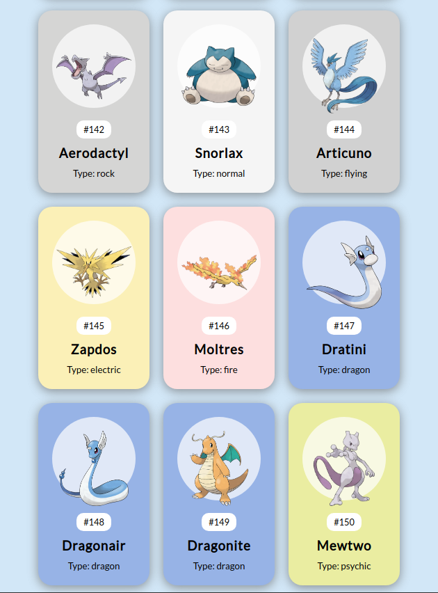

  

  

<h4 align="center">
  Todos os 150, com imagem, id, nome e tipo.
  (indicado pela cor.. rs). 
</h4>

De acordo com a API, Gengar e os outros pokemons do elemento Fastasma são Poison ¯\_ツ_/¯ .

## :rocket: Tecnologias
Esse projeto foi desenvolvido com as seguintes tecnologias:
- [React](https://reactjs.org)

## :pager: Projeto

Fiz esse projeto aqui com o intuito de treinar react,e tive a brilhante ideia de capturar os 150 pokemons. utilizando a [api do Pokemon](https://pokeapi.co/).